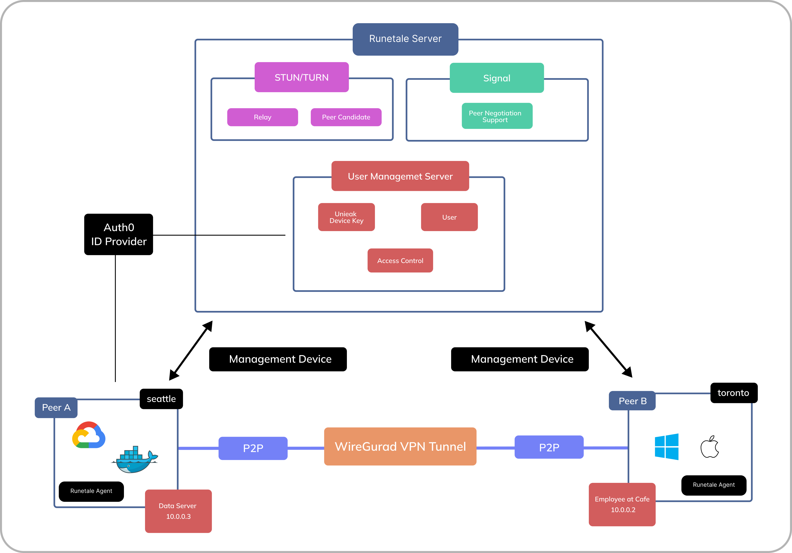

# runetale
- Website: https://runetale.com
- Docs: [https://runetale.com/docs/](https://runetale.com/docs/)
- Architecture: [https://www.runetale.com/docs/architecture/](https://www.runetale.com/docs/architecture/)

# Background
Our goal is to provide the same functionality as existing services that use WireGuard.
This is because we believe that existing problems need to be solved step by step. (Currently Hub&Spoke VPN and secure Private Internet). 
But beyond that, we are developing for the future.

There are two key points we are currently focusing on.
- Scalability of software that runs within the Private Internet after the Secure P2P MeshNetwork future is created.
- Standardization of runetale in the city's Private Internet using IoT devices and LoraWAN.

We predict that some kind of UDP based protocol is the best for these communications at this stage. Currently WireGuard (could be QUIC, etc.)
We believe there is a problem with the current use of Software used within the Private Internet. It is further complicated by existing VPNs, TLS, etc.
These extensions and functions should be combined with secure communication.
In other words, it should be possible to easily install the software we want to use while the secure Internet is standardized using Runetale, like Chrome extensions.
We are developing with such a vision in mind.

# Loadmap
@shinta
- [x] Kernel support for WireGuard
- [x] SSO support
- [x] Automatic peer discovery
- [x] Encrypted P2P connections without a VPN gateway
- [x] Relay of communication when NAT crossing is not possible and P2P connection is not possible
- [] macOS App (Flutter)
- [] Linux App (Flutter)
- [] Access Control Lists
- [] Windows App (Flutter)
- [] MFA
- [] Subnet Connector
- [] Access Control Lists
- [] Network Activity Monitoring
- [] iOS App (Go Mobile)
- [] Android App (Go Mobile)
- [] Runedrop
- [] DNS
- [] Exit Door
- [] SSH

# Architecture
Runetale uses the WireGuard Protocol to provide P2P secure networking.
P2P connections are made using [Pion](https://github.com/pion/ice).
If the NAT cannot be crossed, a Turn server is used to Relay the communication.
It also covers P2P connections via WebRTC via Signal Server using grpc stream internally.

 Here's a more detailed [architecture](https://www.runetale.com/docs/architecture/)

# Contribution Guides
Please read one if you are willing to [CONTRIBUTE](/CONTRIBUTING.md)
These are not yet complete

# Legal
[WireGuard](https://www.wireguard.com/trademark-policy/) is a registered trademark of Jason A. Donenfeld